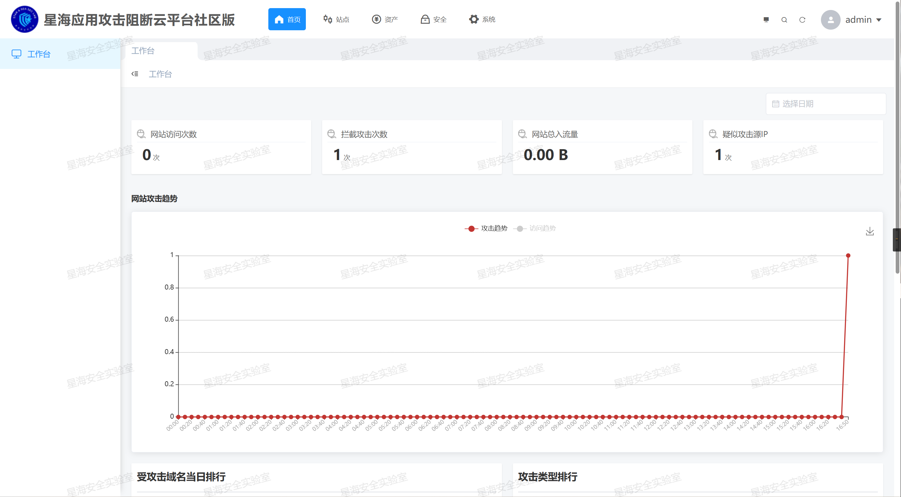
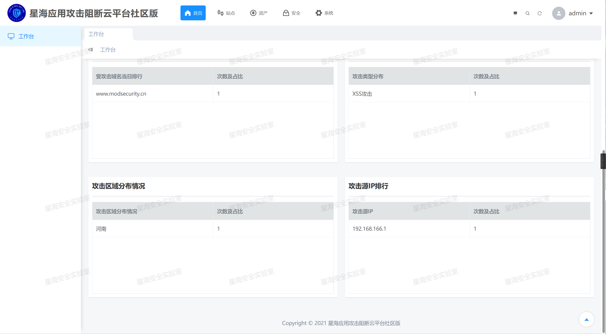
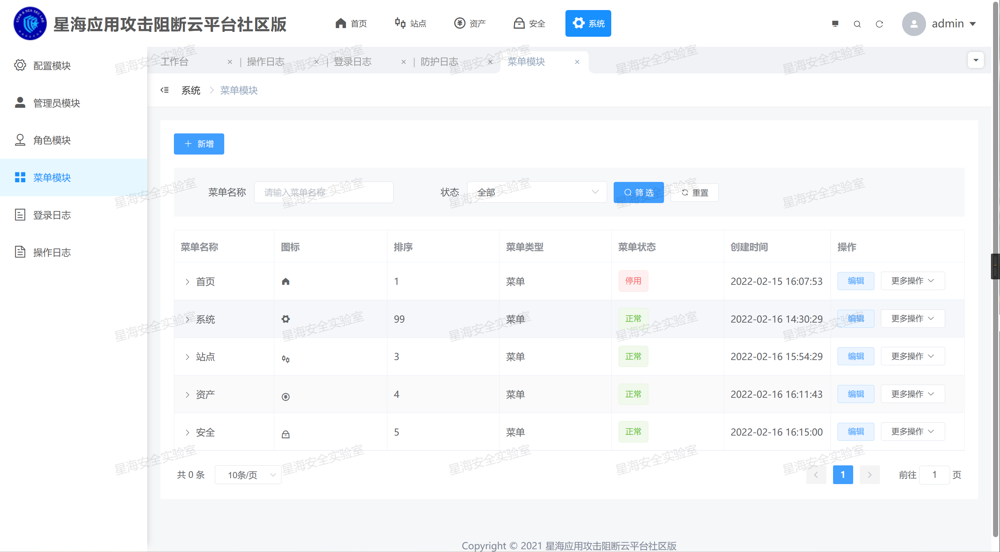
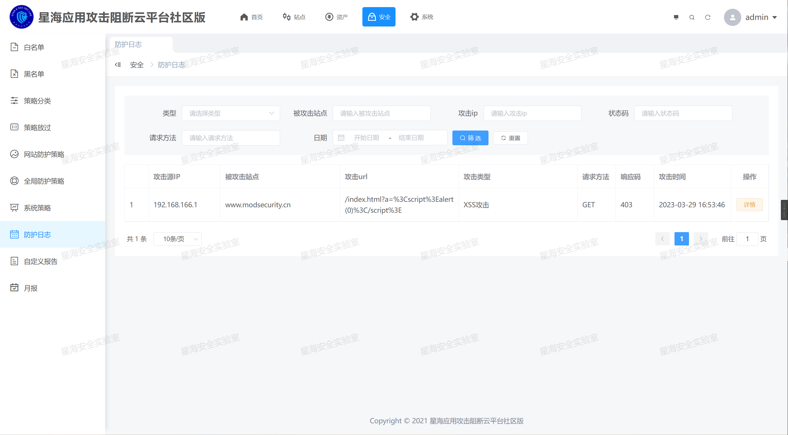

### 一、简述

        星海WAF社区版，是星海安全实验室团队专门为中小企业应用安全打造的一款开源云WAF。
星海安全实验室团队通过将开源ModSecurity封装，实现便于界面操作的云化WAF，并实现和HFish蜜罐联动封禁、操作系统级黑名单封禁、多WAF数据联动、租户管理等功能。

可实现界面化被防护网站业务系统添加、界面化防护规则添加、数据统计，详细功能如下：

- 大屏展示。

- 站点管理：添加、删除、修改网站。

- 资产管理：被保护网站单位信息留存。

- 安全设置：黑白名单、策略放过、网站防护策略、系统策略、防护日志、自定义报告、月报。

- 系统管理：配置模块、管理员模块、角色模块、菜单模块、登录日志、操作日志。

- 二级权限管理，即管理员可以看到所有用户的防护情况，用户只能看到自己业务的防护情况。

适用于中小企业资金有限的云化应用防御。易于使用，下载虚拟机启动即可使用。

### 二、功能截图

功能展示：

大屏：


首页：





系统：



日志：



### 三、安装与使用

#### 资源需求：

CPU6核，内存12G，硬盘100G

#### 虚拟机安装[推荐]

下载方式：

迅雷网盘链接[Releases](https://github.com/ziluobu/DRUST-WAF-Community/releases)

从迅雷网盘下载DRUST-WAF-Community虚拟机到本地

首次使用：

1、使用VMWARE启动DRUST-WAF-Community.vmx

2、访问http://192.168.166.129:10088/ 默认用户名：admin密码：Admin@123

3、根据自身环境修改服务器IP地址。服务器用户名：root密码：root

服务启动与关闭：

1、服务默认随系统自动启动。

2、如需重启可执行`/usr/local/apache/bin/apachectl restart`

### 源码安装[不推荐]

<mark>**因环境搭建较为复杂，仅提供管理后台搭建方式。**</mark>

#### 环境要求

```
- centos  v7.x
- php版本 >= v8.0
- MariaDB版本 >= v10.3 or Mysql >= v5.7
- Redis版本 >= v6.0
- IDE推荐：PhpStorm
```

```克隆源码
git clone https://github.com/ziluobu/DRUST-WAF-Community.git
```

- web项目

```bash
cd DRUST-WAF-Community/web
yarn install
#.env.development 测试环境配置
yarn run serve
#打包
#.env.production 生产环境配置
yarn run build
```

- server项目

```
cd server
composer update
cp .env.example .env

sh sh/buildv2.sh
```

### 测试

本机host中加入`192.168.166.129 www.modsecurity.cn`

### 四、交流互动

随时可加入星海安全实验室安全沙龙微信群交流，二维码如下。

#### 微信

| 加微信进群                                                                       |
|:---------------------------------------------------------------------------:|
|  |

#### 微信交流群

|                                   微信交流群                                    |
|:--------------------------------------------------------------------------:|
|  |

#### 星海安全实验室公众号

|                                 星海安全实验室公众号                                  |
|:---------------------------------------------------------------------------:|
|  |

另外星海安全实验室团队还基于商用WAF内核，打造了一款用于商业市场的云防WAF，欢迎有更高安全需求的大中小型企业联系试用。
